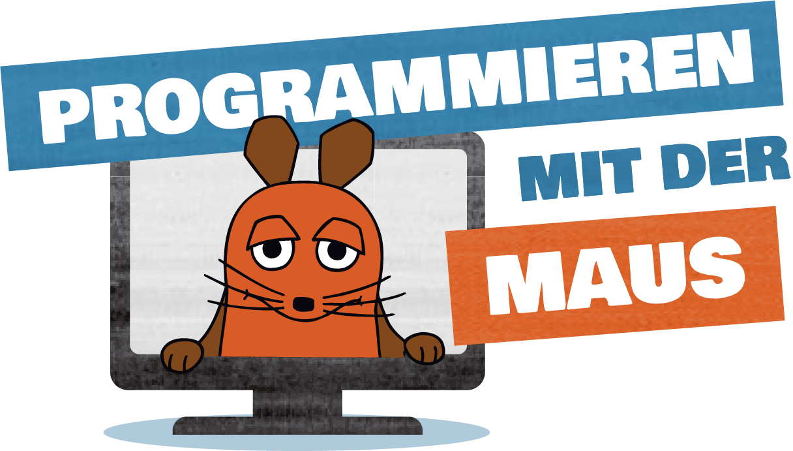
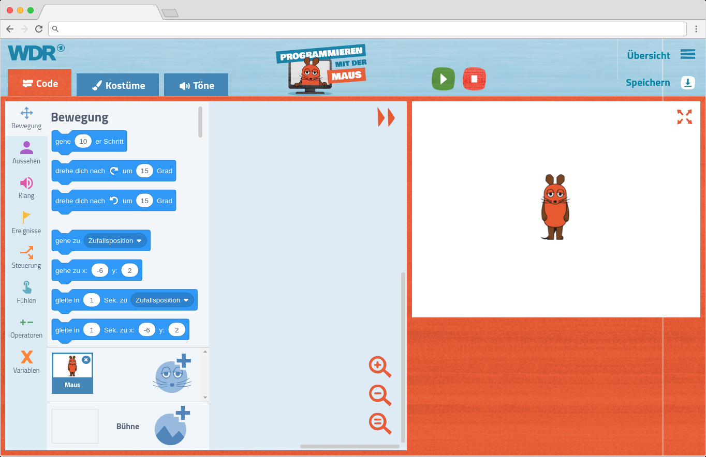
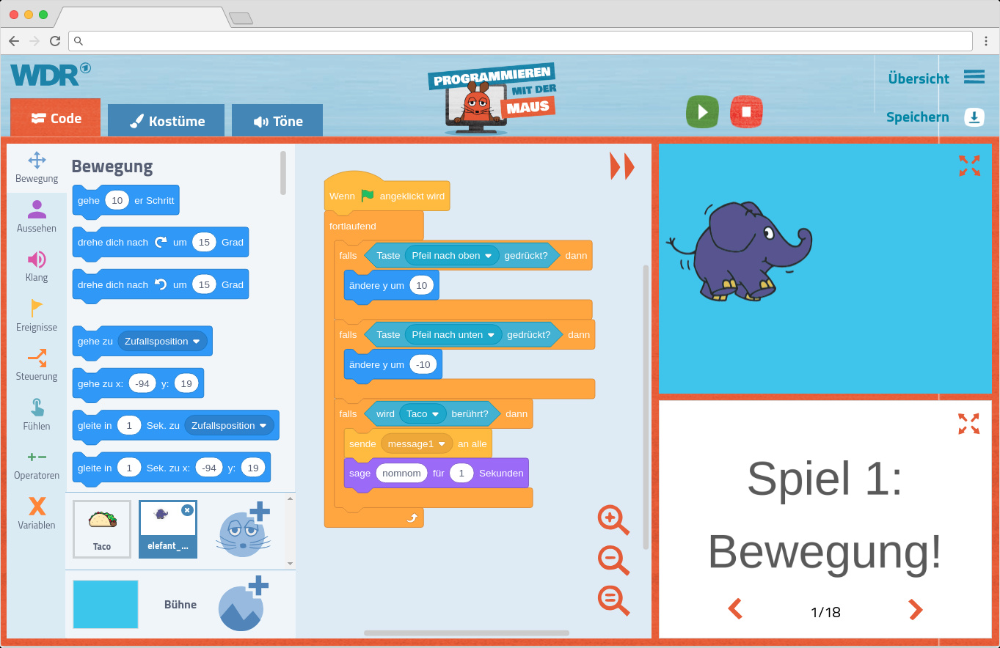

# Programmieren mit der Maus

Am 23. September findet im KiKa ein **Thementag Digitalisierung** statt. Die Sendung mit der Maus nimmt den Tag zum Anlass, um eine Web-Anwendung zu veröffentlichen, die Kinder spielerisch an Grundkonzepte des Programmierens heranführt: 'Programmieren mit der Maus'. Umgesetzt wird das Projekt von uns, dem **Hacking Studio**. Wir sind eine Gruppe von freien Journalistinnen, Entwicklerinnen und Designerinnen, die inhouse innovative, journalistische Produkte mit agilen Methoden entwickeln. Darunter sind datenjournalistische Formate, Chatbots und Webanwendungen. 
Design und UX für 'Programmieren mit der Maus' entwickeln wir zusammen mit Machbar, der Agentur, die auch die Maus-App gemacht hat.  

## Warum Programmieren für Kinder?
- Technologiegetriebener Wandel bestimmt die gesellschaftliche Entwicklung in großem Maße. Große Teile der Gesellschaft haben aber kaum aktiven Anteil an der Gestaltung dieses Wandels.
- Um selbst aktiv werden, mitgestalten und auch Kritik üben zu können, ist Programmieren eine Basis-Fähigkeit, an die Kinder früh herangeführt werden sollten. In den USA spricht man von *Coding Literacy*, also Programmieren als Grundfertigkeit wie Lesen oder Rechnen.
- Besondere Bedeutung hat dabei auch die Mädchen-Förderung, sowie die Förderung anderer bislang in der IT unterrepräsentierter Gruppen.
- Die BBC zum Beispiel hat 2016 publikumswirksam jedem 7-jährigen Kind den Minicomputer *Micro Bit* geschenkt. Auch andere Fernsehsender haben international schon *Programmieren für Kinder*-Serien gestartet.

## Das Projekt
- Auf der Website **Programmieren mit der Maus** werden Kinder durch 3-5 Lernspiele geführt, bei denen sie grundlegende Programmierkonzepte wie Variablen, Schleifen und Verzweigungen kennen lernen.
- Die Kinder erstellen dabei kleine Animationen, Wimmelbilder und erste Spiele.
- Die Kinder haben die Möglichkeit jedes Spiel zu ihrem eigenen zu machen, indem sie Figuren, Hintergründe und Sounds individuell anpassen.
- Die selbst programmierten Spiele können abgespeichert und dann gemeinsam mit Freunden und Verwandten gespielt und wieder verändert werden.
- Zielgruppe sind Kinder ab der 2. bis zur 6. Klasse (7-12 Jahre, die Kinder sollten kurze Texte lesen können. Jüngere Kinder können die Anwendung mit ihren Eltern nutzen.)
- Zielausspielung sind Tablets (ab iOS 11) und Desktop-Geräte, auf Smartphones wird die Anwendung nicht nutzbar sein. (Siehe unten).

## Umsetzung

- Vorbild und Grundlage ist die grafische Programmiersprache [Scratch](https://scratch.mit.edu) des MIT Lifelong Kindergarden (Flash basiert)
- Derzeit baut das MIT Version 3 dieser grafischen Programmiersprache. Die neue Anwendung ermöglicht es, Scratch auch auf Tablets zu benutzen. Die Ausspielung für Smartphones ist derzeit nicht Teil des Projektes. Eine Vorschau davon ist hier zu finden: [https://preview.scratch.mit.edu](https://preview.scratch.mit.edu)
- Scratch ist **Open Source Software**. Deshalb erstellen wir eine WDR-Version von Scratch 3 und passen sie in den Punkten Design, Figuren und Sounds der Sendung mit der Maus an.

## Ausblick

Wir erhoffen uns durch **Programmieren mit der Maus** mehr Kinder spielerisch für das Thema zu begeistern. Dabei ist vor allem wichtig, die selbstbestimmte Mediennutzung zu fördern: *Selbermachen statt konsumieren*.

Auch **Programmieren mit der Maus** wird **Open Source** sein. Das heißt, dass der Code von Personen, Firmen, Vereinen genutzt, angepasst und weiter entwickelt werden kann. Verfügbar ist der Quelltext hier: [https://github.com/wdr-data/code4maus](https://github.com/wdr-data/code4maus)

Denkbar ist zum Beispiel Material für Lehrerinnen und Fachkräfte im offenen Ganztag zu entwickeln. Kurse, AGs, Schulclubs für Kinder zum Thema *Programmieren mit der Maus* sind möglich. Scratch veranstaltet auch regelmäßig so genannte *Scratch-Days*, bei denen sich Kinder treffen und ihr Wissen und ihre Projekte austauschen.

## Team

- Konzept, Programmierung: Patricia Ennenbach, Christine Gotthardt, Marcus Weiner
- Design: Machbar
